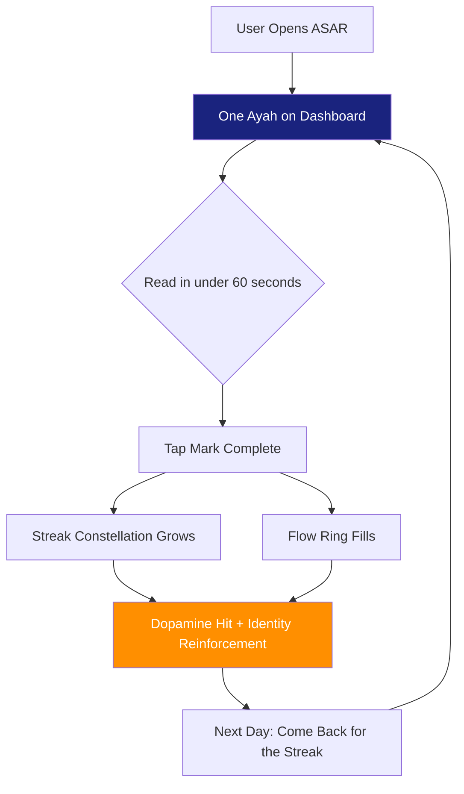
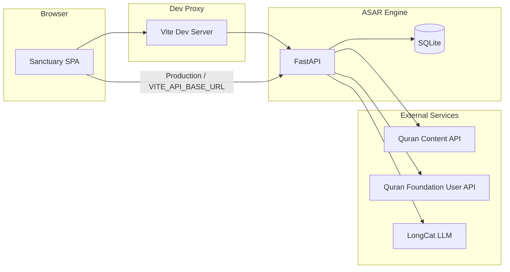
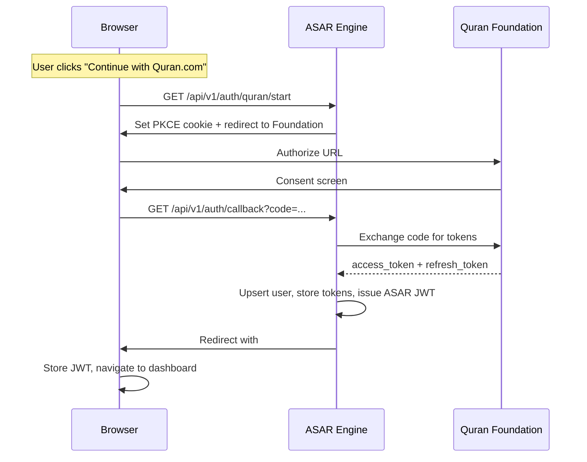
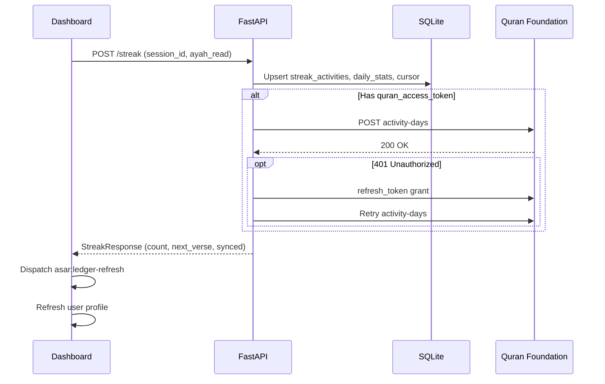

<div align="center">

# 🌙 ASAR Sanctuary

### *Your Intelligent Quran Reading Companion*

[](https://fnwholesale.pk/)

[](https://fastapi.tiangolo.com/)
[](https://react.dev/)
[](https://www.typescriptlang.org/)
[](https://www.python.org/)
[](https://vitejs.dev/)
[](https://www.sqlite.org/)
[](LICENSE)

</div>

---

## Overview

**ASAR Sanctuary** is a full-stack Quran reading and reflection companion that combines a modern React SPA with a robust FastAPI backend. It provides an immersive, distraction-free reading experience enhanced by AI-powered verse exploration, daily habit tracking with visual streak constellations, cloud-synced bookmarks, and a verified RAG-based chat companion — all grounded strictly in authentic Quranic text.

The name **ASAR** reflects the app's mission: leaving a lasting *trace* (Arabic: أثر) in your daily Quran reading journey. Whether you are a beginner setting a 5-minute daily goal or a seasoned reader completing the entire Mushaf, ASAR adapts to your pace and keeps you consistent.

---

## The Problem We Solve — The 60-Second Micro Habit Architecture

> **Most Muslims want to read the Quran daily, but life gets in the way.** The intention is there, the discipline is not.

The #1 reason people abandon Quran reading is not lack of interest — it's **friction**. Traditional apps present the entire 604-page Mushaf and say "go read." That's overwhelming. ASAR flips this model on its head with a **60-Second Micro Habit Architecture** — a behavior-science-driven system that makes daily Quran engagement so small and effortless that skipping it feels harder than doing it.

### How It Works



| Principle | Implementation in ASAR |
|-----------|----------------------|
| **Make it Tiny** | Instead of a chapter or a page, the dashboard surfaces **one single ayah** — readable in under 60 seconds. The barrier to entry is essentially zero. |
| **Make it Visual** | The **Streak Constellation** and **Flow Ring** turn abstract consistency into tangible, growing visual rewards. Each day you complete adds a new star to your constellation — a pattern the brain instinctively wants to continue. |
| **Make it Immediate** | **One-tap mark-complete** — no navigation, no menus, no friction. See the verse, read it, tap done. The entire loop takes less than a minute. |
| **Make it Progressive** | The **reading cursor** automatically advances to the next ayah after each mark-complete. What starts as "just one verse a day" silently compounds into Surahs completed over weeks — without the user ever feeling overwhelmed. |
| **Make it Identity-Driven** | The **Habits Heatmap** and **Insights Engine** reflect the reader's identity back to them: "You are someone who reads Quran every day." Missing a day creates a visible gap — a psychological incentive far stronger than a push notification. |
| **Make it Guided** | Onboarding captures the user's **goal, time budget, and topic interest**, then the **recommended verse engine** delivers personally relevant ayahs. The system adapts to the reader, not the other way around. |

### Why 60 Seconds?

Research in behavioral psychology (BJ Fogg's *Tiny Habits*, James Clear's *Atomic Habits*) consistently shows that **habit formation depends on starting small, not starting big**. A 60-second commitment bypasses the brain's resistance to large tasks. Once the habit loop (cue → routine → reward) is wired at the 60-second level, it naturally expands. Users who start with one ayah begin exploring the Quran Reader, asking the AI Companion questions, and spending 10–15 minutes in the app — but the **entry point never exceeds 60 seconds**.

This is ASAR's core trick: **lower the floor so much that everyone can step in, then let the architecture naturally raise the ceiling.**

---

## Key Features

| Feature | Description |
|---------|-------------|
| **Daily Ayah Dashboard** | Personalized verse recommendation with audio recitation, one-tap mark-complete, and progress tracking |
| **Streak Constellation & Flow Ring** | Visual habit-building — see your consecutive reading days as a growing constellation and a daily progress ring |
| **Quran Reader & Focus Mode** | Browse all 114 Surahs; enter Focus Mode for a distraction-free view with Arabic text, translation, and transliteration |
| **AI Companion (Verified RAG)** | Ask questions about the Quran and receive answers grounded in verified verse text — no hallucinated content |
| **Habits Heatmap** | Calendar-style heatmap of your reading consistency over weeks and months |
| **Insights Engine (AI-Powered)** | Personalized spiritual reflections (themes, rhythm, prompts) generated by LongCat based on your actual session history and heart signals |
| **Dhikr Counter** | Persistent local Tasbih counter that saves your count automatically |
| **Bookmark Library** | Save verses that touch your heart; cloud-synced to your Quran Foundation account |
| **Quran.com OAuth** | Secure sign-in via the Quran Foundation — syncs reading activity and bookmarks across devices |
| **Demo Mode** | Try every feature instantly without linking an external account |

---

## Architecture



The browser loads the Vite-built React SPA. During development, API calls are proxied through Vite to the FastAPI engine. The engine persists state in SQLite, fetches Quranic content from the Quran.com API, syncs user data with the Quran Foundation, and generates AI responses via a LongCat (OpenAI-compatible) LLM endpoint.

---

## Tech Stack

### Backend — ASAR Engine
| Technology | Purpose |
|------------|---------|
| **FastAPI** | Async API framework with automatic OpenAPI docs |
| **SQLAlchemy** | ORM for SQLite persistence |
| **Pydantic** | Settings, schemas, and request/response validation |
| **httpx** | Async HTTP client for Quran API calls |
| **AsyncOpenAI** | OpenAI-compatible client for LongCat LLM |
| **python-jose** | JWT encoding and decoding |
| **passlib** | Password hashing |
| **pytest** | Backend testing |

### Frontend — Sanctuary SPA
| Technology | Purpose |
|------------|---------|
| **React 18** | UI library with hooks and context |
| **TypeScript** | Type-safe development |
| **Vite** | Fast build tool and dev server |
| **React Router** | Client-side routing with guards |
| **Axios** | HTTP client with session and auth interceptors |
| **Vitest** | Unit testing |
| **Playwright** | End-to-end testing |

---

## Getting Started

### Prerequisites

- **Python 3.11+**
- **Node.js 18+** and **npm**
- A **LongCat** (or OpenAI-compatible) API key for LLM features
- A **Quran Foundation** OAuth client ID and secret (for social login)

### 1. Clone the Repository

```bash
git clone https://github.com/<your-username>/asar-sanctuary.git
cd asar-sanctuary
```

### 2. Backend Setup

```bash
cd Back-End

# Create a virtual environment
python -m venv venv
source venv/bin/activate   # Linux/macOS
# venv\Scripts\activate    # Windows

# Install dependencies
pip install -r requirements.txt

# Copy and configure environment variables
cp .env.example .env
# Edit .env with your secrets (see Configuration section below)
```

### 3. Frontend Setup

```bash
cd Front-End

# Install dependencies
npm install

# Copy and configure environment variables
cp .env.example .env
# Edit .env with your API base URL and engine origin
```

### 4. Run the Application

**Terminal 1 — Start the backend:**
```bash
cd Back-End
source venv/bin/activate
uvicorn app.main:app --reload --port 8000
```

**Terminal 2 — Start the frontend:**
```bash
cd Front-End
npm run dev
```

The SPA will be available at **http://localhost:5173** and API requests are automatically proxied to the engine at **http://localhost:8000**.

### 5. Explore

- Open **http://localhost:5173** in your browser
- Click **"Try Demo"** for instant access, or **"Continue with Quran.com"** for a personalized experience
- API docs are available at **http://localhost:8000/docs**

> **Or try it live right now:** [https://fnwholesale.pk/](https://fnwholesale.pk/) — no setup required. Click "Try Demo" to jump in instantly.

---

## Project Structure

```
asar-sanctuary/
├── Back-End/
│   ├── app/
│   │   ├── main.py                  # FastAPI entry, CORS, lifespan
│   │   ├── api/
│   │   │   ├── routes/              # Chat, streak, Quran proxy, history, bookmarks
│   │   │   ├── auth/                # Demo JWT, OAuth, profile endpoints
│   │   │   └── deps.py             # JWT dependencies
│   │   ├── core/
│   │   │   ├── config.py           # Pydantic settings (12-factor)
│   │   │   ├── security.py         # JWT encode/decode
│   │   │   └── logging_config.py   # Structured logging
│   │   ├── models/
│   │   │   ├── domain.py           # SQLAlchemy ORM models
│   │   │   └── schemas.py          # Pydantic request/response schemas
│   │   └── services/
│   │       ├── ai_service.py       # Verified chat pipeline
│   │       ├── chat_rag_rest.py    # REST RAG chat pipeline
│   │       ├── quran_service.py    # Quran content HTTP client
│   │       ├── quran_user_service.py  # Foundation sync
│   │       ├── streak_logic.py     # Streak count algorithm
│   │       ├── reading_cursor_service.py  # Cursor advancement
│   │       ├── bookmark_sync_task.py      # Background bookmark sync
│   │       └── ledger_time.py      # Timezone-aware ledger dates
│   ├── tests/
│   └── requirements.txt
├── Front-End/
│   ├── src/
│   │   ├── App.tsx                  # Router + guards
│   │   ├── main.tsx                 # Entry point + SW registration
│   │   ├── pages/                   # Route page components
│   │   │   ├── WelcomePage.tsx
│   │   │   ├── DashboardPage.tsx
│   │   │   ├── ChatPage.tsx
│   │   │   ├── QuranListPage.tsx
│   │   │   ├── ReaderPage.tsx
│   │   │   ├── FocusPage.tsx
│   │   │   ├── HabitsPage.tsx
│   │   │   ├── OnboardingPage.tsx
│   │   │   └── ...
│   │   ├── context/                 # React contexts
│   │   │   ├── AuthContext.tsx
│   │   │   ├── MoodAyahContext.tsx
│   │   │   └── ...
│   │   ├── layouts/
│   │   │   └── AppShell.tsx         # Navigation shell
│   │   ├── lib/
│   │   │   ├── apiClient.ts         # Axios with auth + session
│   │   │   ├── engineDataCache.ts   # Request deduplication
│   │   │   ├── bookmarksApi.ts
│   │   │   ├── chatPreferences.ts
│   │   │   ├── deriveInsights.ts
│   │   │   └── dhikrStorage.ts
│   │   ├── hooks/
│   │   │   └── useAppSession.tsx
│   │   └── components/
│   │       └── AuthRouteGuards.tsx
│   ├── public/
│   │   └── sw.js                    # Service worker (pass-through)
│   ├── vite.config.ts              # Dev proxy to backend
│   └── package.json
├── DOCUMENTATION.md                 # Full technical documentation
├── USER_GUIDE.md                    # End-user guide
└── README.md                        # This file
```

---

## API Overview

All API endpoints are versioned under `/api/v1`. The engine exposes interactive Swagger UI at `/docs` when running.

### Authentication

| Method | Endpoint | Auth | Description |
|--------|----------|------|-------------|
| `POST` | `/auth/demo` | None | Issue a demo JWT |
| `GET` | `/auth/quran/start` | None | Start Quran Foundation OAuth (PKCE) |
| `GET` | `/auth/callback` | Cookie | OAuth code exchange, issue ASAR JWT |
| `GET` | `/auth/me` | Bearer | Full user profile |
| `PATCH` | `/auth/me/onboarding` | Bearer | Update onboarding preferences |
| `PATCH` | `/auth/me/ledger-timezone` | Bearer | Set streak day-boundary timezone |
| `POST` | `/auth/me/reading-restart` | Bearer | Reset reading cursor |
| `GET` | `/auth/me/recommended-verse` | Bearer | Get next recommended verse |

### Chat & AI

| Method | Endpoint | Auth | Description |
|--------|----------|------|-------------|
| `POST` | `/chat` | Optional | Verified assistant (search + anti-hallucination + LLM) |
| `POST` | `/chat/message` | Optional | REST RAG chat (multi-pipeline with verse cards) |
| `GET` | `/chat/insights` | Optional | AI-powered session analysis and spiritual reflections |
| `GET` | `/history/{session_id}` | Optional | Retrieve chat history |
| `DELETE` | `/history/{session_id}` | Optional | Clear chat history |

### Streak & Habits

| Method | Endpoint | Auth | Description |
|--------|----------|------|-------------|
| `POST` | `/streak` | Optional | Mark ayah complete, advance cursor, sync to Foundation |
| `GET` | `/streak/{session_id}` | Optional | Current streak snapshot |
| `GET` | `/streak/{session_id}/activities` | Optional | Activity log (paginated) |

### Quran Content

| Method | Endpoint | Auth | Description |
|--------|----------|------|-------------|
| `GET` | `/verse` | None | Fetch verse (Uthmani + translation + audio) |
| `GET` | `/chapters` | None | List all 114 Surahs |
| `GET` | `/chapters/{id}` | None | Single Surah metadata |
| `GET` | `/translations` | None | Translation resource catalog |

### Bookmarks

| Method | Endpoint | Auth | Description |
|--------|----------|------|-------------|
| `GET` | `/bookmarks` | Bearer | List saved verses |
| `POST` | `/bookmarks` | Bearer | Save a verse with optional note |
| `DELETE` | `/bookmarks/{surah_id}/{ayah_number}` | Bearer | Remove a bookmark |

---

## AI Chat Pipelines

ASAR implements two distinct chat pipelines, both designed to prevent hallucination and ground responses in verified Quranic text.

### Verified Assistant (`POST /chat`)

A strict pipeline that searches the Quran API for matching verses, fetches their Uthmani text, translation, and tafsir, and only then constructs an LLM prompt using verified facts. If no specific verse is found, it returns a fixed "cannot find" response rather than fabricating one.

### REST RAG Chat (`POST /chat/message`)

A richer retrieval-augmented generation pipeline with multiple configurable stages:

1. **Query Bridge** — Optional LLM call to refine the user's question into an effective search phrase
2. **JSON Query Planner** — Optional multi-query decomposition
3. **Quran Search** — Retrieves candidate verses from the Quran.com API
4. **Relevance Gate** — Trims weak or unrelated hits
5. **Neighbor Context** — Optionally adds surrounding ayahs for richer context
6. **Alignment Check** — Optional second LLM pass to verify answer alignment
7. **Verse Cards** — Returns structured verse objects alongside the answer

The Sanctuary UI uses the REST RAG pipeline exclusively. Both pipelines support multi-turn conversation history (up to 24 recent turns).

---

## Authentication Flow



Two login paths are supported:

- **Demo Login** — Instant access with a pre-configured account; no external auth required
- **Quran Foundation OAuth** — Full PKCE flow with activity and bookmark sync to the user's Quran Foundation account

---

## Configuration

All configuration is handled via environment variables (12-factor style). Copy `.env.example` to `.env` and fill in the values. **Never commit secrets to the repository.**

### Core Settings

| Variable | Description | Default |
|----------|-------------|---------|
| `DATABASE_URL` | SQLAlchemy connection string | `sqlite:///./asar.db` |
| `CORS_ORIGINS` | Comma-separated allowed origins | localhost defaults |
| `JWT_SECRET_KEY` | JWT signing secret (change in production!) | — |
| `JWT_ALGORITHM` | JWT signing algorithm | `HS256` |
| `ACCESS_TOKEN_EXPIRE_MINUTES` | Token lifetime | — |
| `ENABLE_DEMO_LOGIN` | Enable demo account access | `false` |
| `DEMO_USER_EMAIL` | Demo account email | — |
| `DEMO_USER_PASSWORD` | Demo account password | — |

### LLM (LongCat)

| Variable | Description |
|----------|-------------|
| `LONGCAT_API_KEY` | API key for the OpenAI-compatible LLM service |
| `LONGCAT_BASE_URL` | Base URL for completions endpoint |
| `LONGCAT_MODEL` | Model identifier |
| `LONGCAT_CHAT_MAX_TOKENS` | Max tokens per response |
| `LONGCAT_CHAT_TEMPERATURE` | Sampling temperature |

### Quran Content API

| Variable | Description |
|----------|-------------|
| `QURAN_API_BASE_URL` | Quran.com-compatible content API base URL |
| `QURAN_API_KEY` | Optional API key for content requests |
| `QURAN_TRANSLATION_RESOURCE_ID` | Default translation resource |
| `QURAN_CONTENT_LANGUAGE` | Primary content language |
| `QURAN_SEARCH_LANGUAGE` | Language for search queries |
| `QURAN_AI_MAX_VERSES` | Cap on verses in LLM context |
| `QURAN_VERSE_AUDIO_URL_TEMPLATE` | Fallback audio URL pattern |

### Quran Foundation OAuth

| Variable | Description |
|----------|-------------|
| `QURAN_CLIENT_ID` | OAuth client ID |
| `QURAN_CLIENT_SECRET` | OAuth client secret |
| `QURAN_OAUTH_AUTHORIZE_URL` | Authorization endpoint |
| `QURAN_OAUTH_TOKEN_URL` | Token exchange endpoint |
| `QURAN_OAUTH_REDIRECT_URI` | Registered redirect URI |
| `QURAN_OAUTH_AUTHORIZE_SCOPES` | Requested OAuth scopes |
| `QURAN_USER_API_BASE_URL` | User API base URL |
| `QURAN_ACTIVITY_SYNC_POST_URL` | Activity sync endpoint |
| `FRONTEND_AFTER_OAUTH_URL` | SPA URL for post-login redirect |

### Frontend

| Variable | Description |
|----------|-------------|
| `VITE_API_BASE_URL` | API base (e.g. `/api/v1` or full engine URL) |
| `VITE_ASAR_ENGINE_ORIGIN` | Engine origin for OAuth start (must match redirect URI host) |

### Ledger Timezone

| Variable | Description |
|----------|-------------|
| `ASAR_LEDGER_TIMEZONE` | Default IANA timezone for streak day boundaries |

---

## Database Schema

| Table | Purpose |
|-------|---------|
| `users` | Accounts, OAuth tokens, onboarding state, reading cursor, session ID |
| `user_sessions` | UUID-keyed sessions — parent for messages and streak rows |
| `chat_messages` | Per-session chat log (user/assistant roles) |
| `streak_activities` | Daily activity records (unique per session + date) |
| `reading_daily_stats` | Per-user daily mark counts for dashboard ring |
| `verse_bookmarks` | Saved verses with sync status to Quran Foundation |

---

## Frontend Routes

| Route | Page | Guard |
|-------|------|-------|
| `/welcome` | Welcome & login | Public |
| `/welcome/oauth` | OAuth callback handler | Public |
| `/onboarding` | First-time setup | JWT required |
| `/` | Dashboard (daily ayah, streak) | JWT + Onboarding |
| `/quran` | Surah list | JWT + Onboarding |
| `/quran/:surahId` | Quran reader | JWT + Onboarding |
| `/focus` | Focus mode | JWT + Onboarding |
| `/chat` | AI companion | JWT + Onboarding |
| `/habits` | Habit heatmap | JWT + Onboarding |
| `/insights` | Reading insights | JWT + Onboarding |
| `/library` | Bookmarks | JWT + Onboarding |
| `/dhikr` | Dhikr counter | JWT + Onboarding |
| `/settings` | App settings | JWT + Onboarding |
| `/settings/reading` | Reading preferences | JWT + Onboarding |

---

## Testing

### Backend

```bash
cd Back-End
source venv/bin/activate
pytest                          # Run all tests
pytest tests/test_chat_rag_rest.py   # Specific test file
```

**Stack:** pytest, pytest-asyncio, httpx, anyio

### Frontend

```bash
cd Front-End
npm test                        # Vitest unit tests
npm run test:e2e                # Playwright end-to-end tests
```

### Interactive API Docs

When the engine is running, visit **http://localhost:8000/docs** for the Swagger UI — try `POST /chat` and `POST /chat/message` directly from the browser.

---

## Production Checklist

Before deploying to production, ensure the following:

- [ ] `JWT_SECRET_KEY` is set to a long, random value (24+ characters) — not the repo default
- [ ] `CORS_ORIGINS` lists only your production SPA origins
- [ ] `ENABLE_DEMO_LOGIN` is set to `false` if demo access is not desired
- [ ] `DATABASE_URL` points to a persistent, backed-up database
- [ ] `FRONTEND_AFTER_OAUTH_URL` matches your production SPA URL
- [ ] All API keys and secrets are in environment variables or a secret store — never in the repo
- [ ] `QURAN_OAUTH_REDIRECT_URI` is registered in the Quran Foundation console (byte-for-byte match)
- [ ] The `/health` endpoint (`GET /health`) is used for liveness probes

### OAuth Redirect URI Notes

The redirect URI must target the **engine host** (e.g. `http://localhost:8000/api/v1/auth/callback`), **not** the Vite dev server. Use `GET /api/v1/auth/quran/redirect-uri-hint` to verify your configured URI at runtime. `VITE_ASAR_ENGINE_ORIGIN` must use the same host and port so the PKCE cookie is sent on callback.

---

## Mark-Complete Sequence



---

## Contributing

1. Fork the repository
2. Create a feature branch: `git checkout -b feature/your-feature-name`
3. Commit your changes: `git commit -m "Add your feature"`
4. Push to the branch: `git push origin feature/your-feature-name`
5. Open a Pull Request

Please ensure all existing tests pass and add tests for new functionality.

---

## Documentation

| Document | Description |
|----------|-------------|
| [USER_GUIDE.md](USER_GUIDE.md) | End-user guide for the Sanctuary application |
| [DOCUMENTATION.md](DOCUMENTATION.md) | Full technical documentation (architecture, APIs, config) |

---

## License

This project is licensed under the MIT License. See the [LICENSE](LICENSE) file for details.

---

<div align="center">

**Built with faith and code**

*ASAR — Leave a lasting trace in your Quran journey*

</div>
